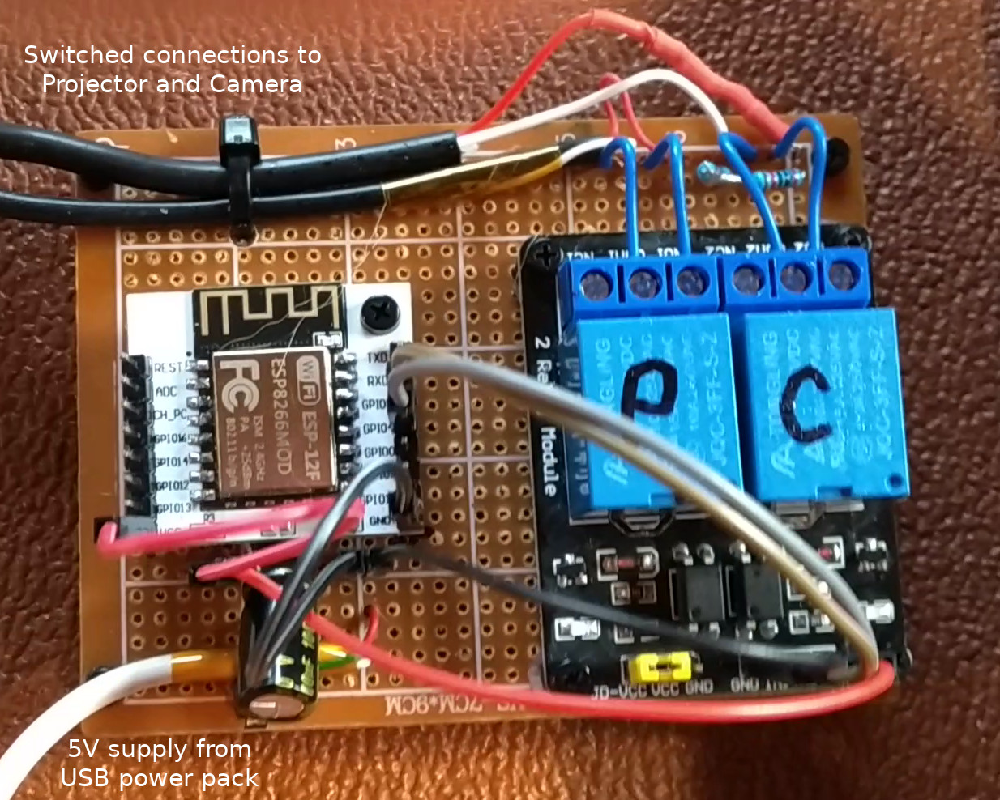
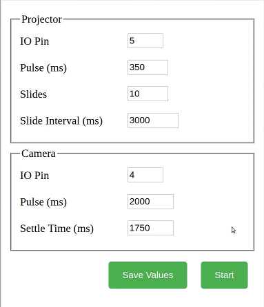

Arduino ESP8266 sketch to control a slide projector and camera, in order to digitise slides at high speed.

# Digitising 35mm slides quickly using projector, DSLR camera and microcontroller

## Introduction - the problem

We have a large collection of 35mm photo slides. Some were taken by my father-in-law in the 1950s, 60s, 70s and 80s. Some were taken by me or my wife in the 80s and 90s. 

I want to digitise these, and I took inspiration from various projects listed below, the common approach being to use a DSLR camera and a Kodak Carousel slide projector. 

## The photographic approach

I used a Kodak Carousel S-AV 1050 projector. By removing the front, objective, lens from the projector, and also covering the internal condenser lens with white acrylic square, to diffuse the light, the projector becomes effectively a high-illumination lightbox, with a slide-chager mechanism attached. 

The camera requires a macro lens, one that can photograph the slide (36mm x 24nmm) at somewhere between life-size and half life-size, depending on the size of the camera sensor. 

The camera I use, a Panasonic Lunix G1, is micro four-thirds format, with a sensor size of 18mm x 13.5mm, i.e. roughly half the size of a 35mm slide. So a macro lens of 1:2 reproduction ratio is sufficient. I chose the 7artisans 60mm f/2.8 macro lens, which is good value and gets great reviews for image quality. It's a manual focus lens but that absolutely no problem for this project.

The camera lens is pointed into the hole at the front of the projector, where the objective lens would normally be. With a slide in position, one has to carefully position the camera and projector so that the lens is contred on the slide, its axis is perpendicular to the slide (to ensure no keystone distortion), and the distance from camera to slide is such that the image of the slide sits within the edges of the sensor. The lens aperature can be opened up to f/2.8 for accurate focusing, and then closed down to f/8.0 for optimal sharpness and a depth of field somewhere between 1-2mm, which is fine to ensure sharp focus right across the slide.

The camera was set to manual focus, and aperture-priority automatic exposure. Photos were taken in raw mode, to preserve flexibility over setting exposure and white balance in post-processing. I used the camera's ability to bracket exposures to take three images of each slide, at the automatice exposure and +/- 2/3 of a stop.

The setup is pictured below.

## Automation

[B A Bryce](http://babryce.com/slidedigitizer.html) noted that he had used an AVRTiny2313 to automate to advancing of slides and triggering of the camera shutter. I wanted to do something similar but using the ESP8266 microcontroller. The ESP chips have similar GPIO capabilities to AVRTiny2313, and can be programmed using the Arduino development environment, but have one big advantage over AVR and Arduino; they support WiFi communications and can implement a web server. Whereas Bryce used DIP switches to configure timing and set the number of slides to be photographed, with ESP8266 it's easy to write a small web application to configure these parameters.

If you are thinking of implementing this project, it would be easiest to use a NodeMCU or Wemos D1 development board as your controller, which have useful features (USB programming and voltage regulator), but I had a bunch of bare ESP-12F chips, so I soldered one to a breakout board, together with decoupling capacitors and and a regulator. Either way should work fine with this code. 

Two GPIO pins are used to control a pair of relays: one to trigger the slide advance on the projector, and the other to trigger the shutter release on the camera. Both projector and camera are triggered by closing a switch for a defined amount of time. My camera, a Panasonic Lumix G1, has a [slightly complex remote triggering arrangement](https://www.robotroom.com/Macro-Photography-2.html), which allows for focus-control as well as shutter-control, but as we are using manual focus in this project, I only implemented the shutter-control switch. The connection to the camera is made with a 2.5mm 4-conductor jack. The connection to the projector is made via a 

Both the ESP8266 and the Relays are powered by 5V from a USB power pack. The two components are mounted on perfboard, but that's just a convenience for stability, rather than any electrical interconnect reasons.

The web interface is built as a single HTML file containing one form, with some simple CSS styling, and a tiny piece of Javascript to read configuration parameters from a JSON file and populate the form fields with initial values. The form has two action buttons
* the first to update the saved parameters, so they will become the default next time the form is presented, and
* the second to start capturing slides

Here's a screen shot of the web interface:

The cycle of actions to digitise one slide is as follows:
* Close the projector relay for a period defined by *Projector: Pulse*. Kodak specifies 200-750ms. The projector drops a new slide into the beam.
* Wait for a short interval, *Camera:Settle Time*, to ensure the slide is stationary.
* Close the camera relay for a period defined by *Camera:Pulse*. I found this needed to be at least 2 seconds, due to exposure bracketing; the shutter release must remain pressed for as long as it takes to photograph and store three images in the camera's buffer.
* Pause for a further period defined by *Projector:Interval* to allow images to be written to disk.

With my rather ancient Panasonic G1, and a class 10 memory card, I found I could take process one slide (with three bracketed images) in around 6 seconds. Thus a full, 80-slide carousel can be processed, unattended, in about 8 minutes. 
 
Inspired by:
* http://babryce.com/slidedigitizer.html and https://www.flickr.com/photos/bbryce/4149018287
* https://www.scantips.com/es-1.html
* https://petapixel.com/2014/02/11/neat-diy-projector-rig-lets-digitize-15-slides-per-minute-automatically/
* https://hackaday.io/project/158667-kodak-slide-projector-scanner and https://www.youtube.com/watch?v=V_DTgok2Bfw
* https://www.youtube.com/watch?v=D91gBsKxtfg
