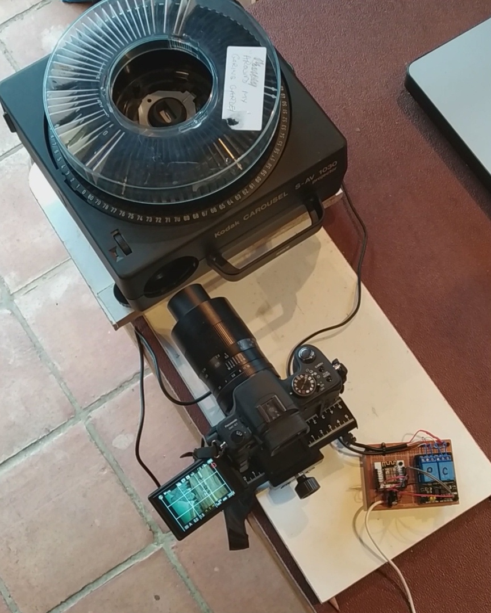

Arduino ESP8266 sketch to control a slide projector and camera, in order to digitise slides at high speed.

We have a large collection of 35mm photo slides. Some were taken by my father-in-law in the 1950s, 60s, 70s and 80s. Some were taken by me or my wife in the 80s and 90s. 

I want to digitise these, and I took inspiartion from various projects listed below, the common approach being to use a DSLR camera and a Kodak Carousel slide projector. By removing the front, objective, lens from the projector, and also covering the internal condenser lens with some form of diffuser, the projector becomes effectively a high-illumination lightbox, with a slide-chager mechanism attached. 

The camera requires a macro lens, one that can photograph the slide (36mm x 24nmm) at somewhere between life-size and half life-size, depending on the size of the camera sensor. 

The camera I use is a micro four-thirds format, with a sensor size of 18mm x 13.5mm, i.e. roughly half the size of a 35mm slide. So a macro lens of 1:2 reproduction ratio is sufficient. I chose the 7artisans 60mm f/2.8 macro lens, which is good value and gets great reviews for image quality. It's a manual focus lens but that absolutely no problem for this project.

The camera lens is pointed into the hole at the front of the projector, where the objective lens would normally be. With a slide in position, one has to carefully position the camera and projector so that the lens is contred on the slide, its axis is perpendicular to the slide (to ensure no keystone distortion), and the distance from camera to slide is such that the image of the slide sits within the edges of the sensor. The lens aperature can be opened up to f/2.8 for accurate focusing, and then closed down to f/8.0 for optimal sharpness and a depth of field somewhere between 1-2mm, which is fine to ensure sharp focus right across the slide.

The setup is pictured below.

 
Inspired by:
* http://babryce.com/slidedigitizer.html and https://www.flickr.com/photos/bbryce/4149018287
* https://www.scantips.com/es-1.html
* https://petapixel.com/2014/02/11/neat-diy-projector-rig-lets-digitize-15-slides-per-minute-automatically/
* https://hackaday.io/project/158667-kodak-slide-projector-scanner and https://www.youtube.com/watch?v=V_DTgok2Bfw
* https://www.youtube.com/watch?v=D91gBsKxtfg
